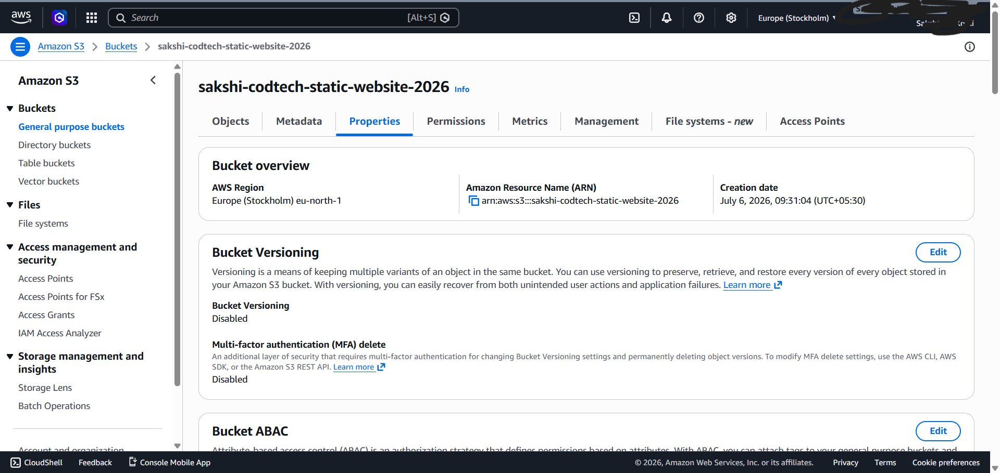
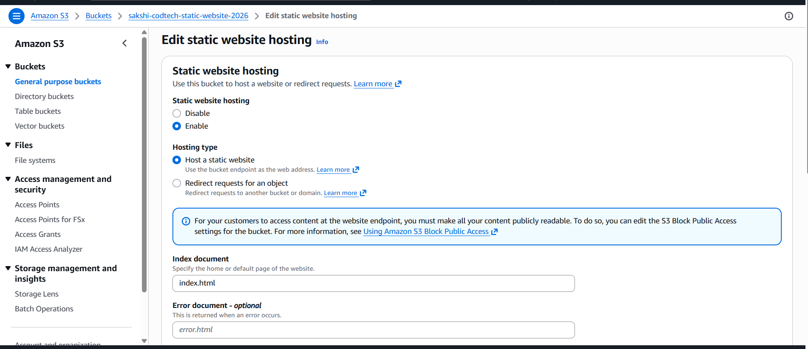
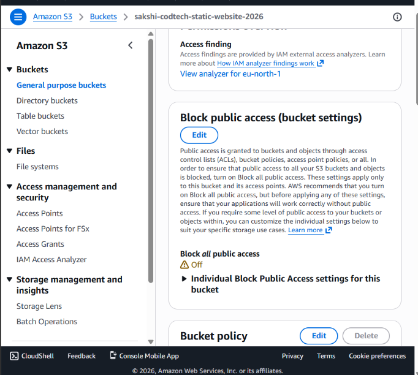
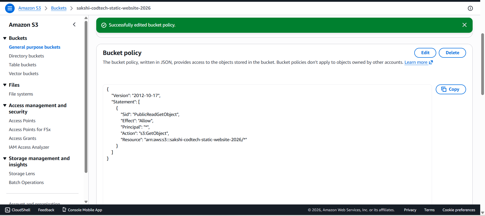
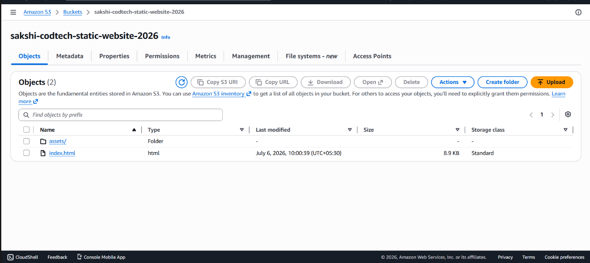
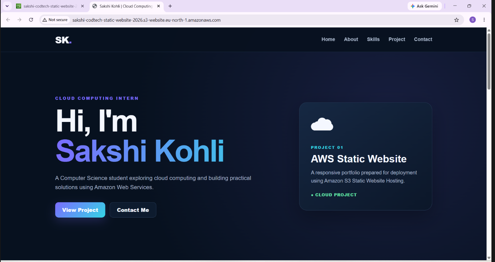

# PROJECT DOCUMENTATION

## 1. Project Title

**AWS Static Website Hosting**

---

## 2. Internship Details

- **Intern ID:** CITS5437
- **Full Name:** Sakshi Kohli
- **Organization:** CODTECH
- **Domain:** Cloud Computing
- **Duration:** 4 Weeks
- **Project Name:** AWS Static Website Hosting

---

## 3. Abstract

This project demonstrates the development and cloud deployment of a responsive static portfolio website using Amazon S3 Static Website Hosting.

The website was developed using HTML5, CSS3, and JavaScript. It contains information about the intern, technical skills, project details, and contact information. After local testing, the complete website was uploaded to an Amazon S3 bucket while preserving the original folder structure.

Static Website Hosting was enabled on the S3 bucket, public access settings were configured, and a bucket policy was added to allow public read access to the website files. The final website was successfully deployed and tested using the Amazon S3 website endpoint.

---

## 4. Project Objectives

The main objectives of this project are:

- To develop a professional and responsive static portfolio website.
- To understand the structure of a cloud-hosted web application.
- To organize HTML, CSS, and JavaScript files using a proper folder structure.
- To create and configure an Amazon S3 bucket.
- To enable Amazon S3 Static Website Hosting.
- To configure public access settings for website files.
- To add a bucket policy for public read access.
- To upload project files while preserving the folder structure.
- To test the deployed website using the S3 website endpoint.
- To maintain complete project documentation and deployment screenshots.
- To use Git and GitHub for source-code management and project submission.

---

## 5. Technologies and Tools Used

### 5.1 HTML5

HTML5 was used to create the structure and content of the portfolio website.

### 5.2 CSS3

CSS3 was used to create the professional visual design, responsive layout, navigation bar, sections, buttons, and mobile-friendly interface.

### 5.3 JavaScript

JavaScript was used to provide interactive functionality and improve the user experience.

### 5.4 Amazon Web Services (AWS)

AWS was used as the cloud platform for deploying the project.

### 5.5 Amazon S3

Amazon S3 was used to:

- Store the website files.
- Configure public access.
- Enable Static Website Hosting.
- Provide a public website endpoint.

### 5.6 Git and GitHub

Git and GitHub were used for:

- Version control.
- Source-code storage.
- Project documentation.
- Deployment screenshot storage.
- Internship project submission.

### 5.7 GitHub Desktop

GitHub Desktop was used to commit and publish project files and screenshots to the GitHub repository.

### 5.8 Visual Studio Code

Visual Studio Code was used to create and edit the HTML, CSS, JavaScript, Markdown, and text files.

---

## 6. AWS Deployment Configuration

| Configuration | Details |
|---|---|
| AWS Service | Amazon S3 |
| AWS Region | Europe (Stockholm) |
| Region Code | eu-north-1 |
| Bucket Name | sakshi-codtech-static-website-2026 |
| Hosting Type | Static Website Hosting |
| Index Document | index.html |
| Website Status | Successfully Deployed |

---

## 7. Project Structure

```text
AWS-Static-Website-Hosting/
│
├── index.html
├── README.md
├── STRUCTURE.txt
│
├── assets/
│   ├── css/
│   │   └── style.css
│   ├── js/
│   │   └── script.js
│   └── images/
│
├── documentation/
│   ├── PROJECT_DOCUMENTATION.md
│   └── VIVA_QUESTIONS.md
│
└── screenshots/
    ├── 01-s3-bucket-created.png
    ├── 02-static-website-hosting-enabled.png
    ├── 03-public-access-off.png
    ├── 04-bucket-policy-added.png
    ├── 05-project-files-uploaded.png
    ├── 06-live-website-output.png
    └── SCREENSHOT_GUIDE.txt
```

---

## 8. Website Implementation

The website was developed using separate files for structure, styling, and functionality.

### Main HTML File

The main entry point of the website is:

`index.html`

### CSS File

The external stylesheet is stored at:

`assets/css/style.css`

The CSS file is connected to the HTML file using:

```html
<link rel="stylesheet" type="text/css" href="./assets/css/style.css">
```

### JavaScript File

The JavaScript file is stored at:

`assets/js/script.js`

It is connected to the HTML file using:

```html
<script src="./assets/js/script.js"></script>
```

The complete folder structure was preserved during the Amazon S3 upload. This is necessary because changing the file paths would prevent the CSS and JavaScript files from loading correctly.

---

## 9. Website Features

The portfolio website includes:

- Professional responsive design.
- Navigation bar.
- Home section.
- About section.
- Skills section.
- Project section.
- Contact section.
- Mobile-friendly layout.
- External CSS styling.
- External JavaScript functionality.
- Cloud deployment using Amazon S3.

---

## 10. AWS S3 Deployment Procedure

### Step 1: AWS Account Access

The AWS Management Console was opened and the Amazon S3 service was selected.

### Step 2: Create an S3 Bucket

A new S3 bucket was created with the unique name:

`sakshi-codtech-static-website-2026`

The selected AWS region was:

`Europe (Stockholm) - eu-north-1`

### Step 3: Enable Static Website Hosting

The bucket Properties section was opened.

Static Website Hosting was enabled with the following configuration:

- **Hosting Type:** Host a static website
- **Index Document:** index.html

### Step 4: Configure Public Access

The bucket-level Block Public Access setting was disabled so that the website files could be publicly accessed.

### Step 5: Add Bucket Policy

A bucket policy was configured to allow public read access to the website objects.

The policy allowed the `s3:GetObject` action for the website files stored in the bucket.

### Step 6: Upload Project Files

The website files were uploaded to Amazon S3 while preserving the original folder structure.

The main uploaded files included:

- `index.html`
- `assets/css/style.css`
- `assets/js/script.js`

### Step 7: Open the Website Endpoint

The S3 Static Website Hosting endpoint was opened in a web browser.

The website loaded successfully with complete HTML structure, CSS styling, and JavaScript functionality.

---

## 11. Deployment Screenshots

### 11.1 S3 Bucket Created



### 11.2 Static Website Hosting Enabled



### 11.3 Public Access Configuration



### 11.4 Bucket Policy Added



### 11.5 Project Files Uploaded



### 11.6 Live Website Output



---

## 12. Actual Result

The project was successfully completed and deployed using Amazon S3 Static Website Hosting.

The final website:

- Loads successfully in a web browser.
- Displays the complete portfolio design.
- Loads the external CSS file correctly.
- Uses the correct project folder structure.
- Is publicly accessible through the Amazon S3 website endpoint.
- Is documented and stored in a GitHub repository.

---

## 13. Learning Outcomes

Through this project, I learned:

- How Amazon S3 stores and manages objects.
- How to create and configure an S3 bucket.
- How to enable Static Website Hosting.
- How public access settings affect website availability.
- How an S3 bucket policy provides access to website objects.
- How to deploy HTML, CSS, and JavaScript files to the cloud.
- Why preserving the correct folder structure is important.
- How to test a cloud-hosted website.
- How to use GitHub Desktop for version control.
- How to maintain professional project documentation.

---

## 14. Challenges Faced

During the implementation of the project, the following challenges were encountered:

- Ensuring that the CSS file was linked using the correct relative path.
- Preserving the `assets/css` and `assets/js` folder structure.
- Configuring public access settings correctly.
- Adding the correct S3 bucket policy.
- Understanding the difference between the S3 object URL and the static website endpoint.
- Organizing deployment screenshots with meaningful file names.

These challenges were resolved by checking the file paths, verifying the bucket configuration, and testing the final website endpoint.

---

## 15. Security Considerations

The following security practices were followed:

- AWS access keys were not uploaded to GitHub.
- Secret access keys were not stored in project files.
- Passwords and private credentials were not committed to the repository.
- Only the website files required for public access were stored in the public S3 bucket.
- Public access was configured only for this static website project bucket.

---

## 16. Conclusion

The AWS Static Website Hosting project was successfully completed.

A responsive portfolio website was developed using HTML5, CSS3, and JavaScript and deployed using Amazon S3 Static Website Hosting. The project provided practical experience with S3 bucket creation, public access configuration, bucket policies, static website hosting, cloud deployment, GitHub version control, and technical documentation.

The final result demonstrates how a static website can be hosted and made publicly accessible using Amazon Web Services.

---

## 17. Author

**Sakshi Kohli**  
Cloud Computing Intern  
**CODTECH**  
**Intern ID:** CITS5437

---

## 18. Project Status

**Completed and Successfully Deployed**
